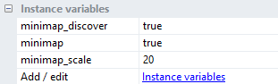

#This plugin allow you to easily integrate a minimap into your Construct 2 game

##Features
You can see the ACE table [here](/ace.md)

##Instance variables
You can define "per instance" variables that override default behaviours

###Available variables are : 

- **minimap** : <u>required</u> if you want to show this object on the map
- **minimap_discover** : The object is not shown until *discovered* state is set to true (and *show* also set to true)
- **minimap_scale** : The object will be scale to this factor on the minimap
- More are coming

Do not hesitate to send me your ideas and how I could improve the plugin

*Thanks to @skymen for the Icon*